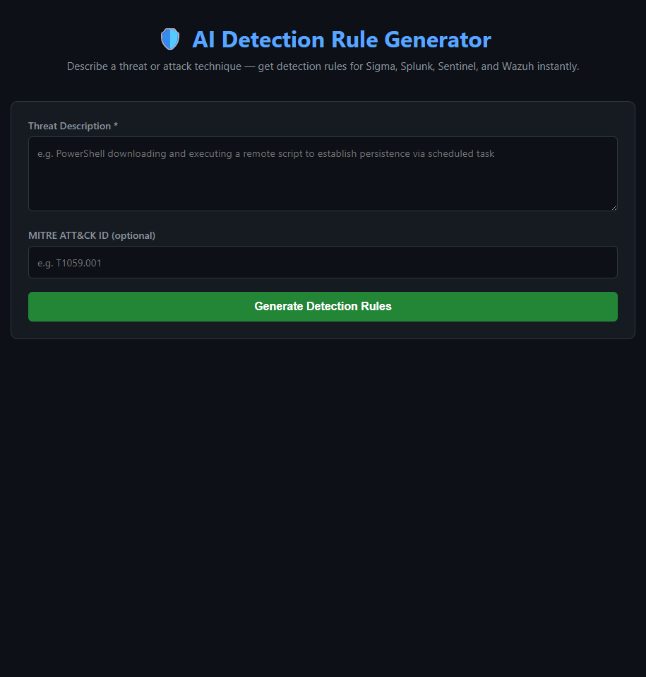
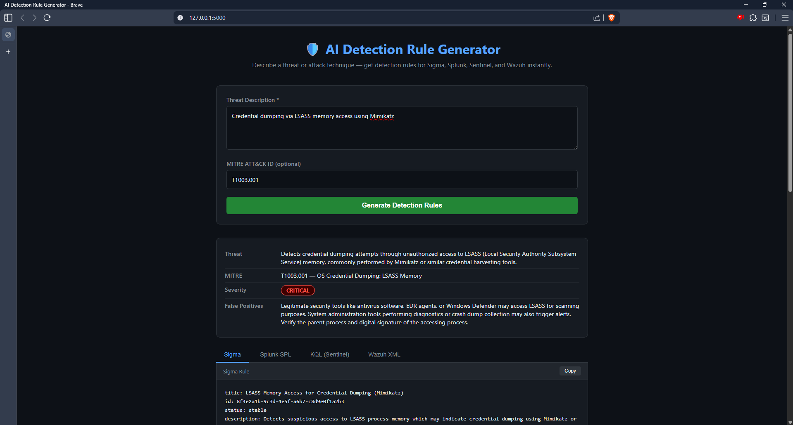
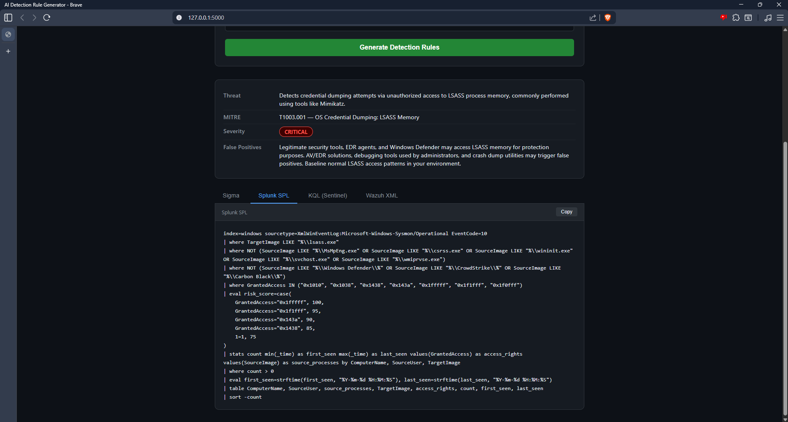
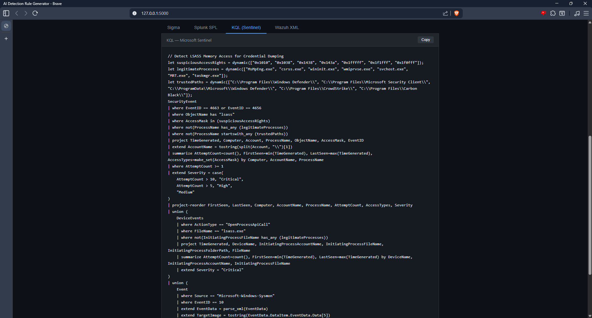
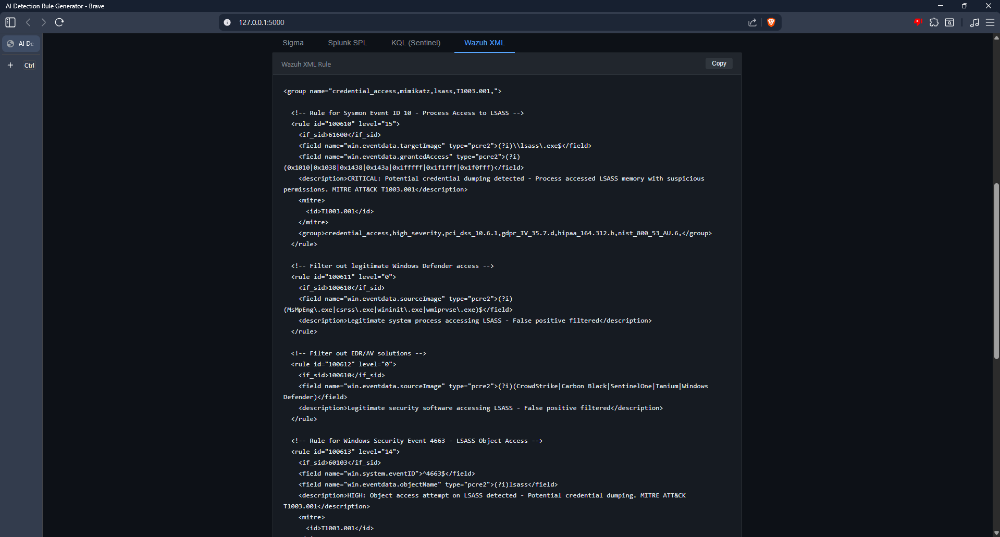

# AI Detection Rule Generator

AI-powered detection rule generator that converts threat descriptions and MITRE ATT&CK technique IDs into production-ready detection rules across four platforms — built with Python, Flask, and the Anthropic Claude API.

## Output Formats
- Sigma (universal YAML)
- Splunk SPL
- Microsoft Sentinel KQL
- Wazuh XML

## Features
- MITRE ATT&CK technique mapping
- Severity classification (Critical / High / Medium / Low)
- False positive notes per rule
- Risk scoring in Splunk and KQL outputs
- One-click copy per format
- Clean dark-mode UI

## Tech Stack
Python · Flask · Anthropic Claude API · HTML/CSS/JS

## Setup
1. Clone the repo
2. `python -m venv venv && venv\Scripts\activate`
3. `pip install -r requirements.txt`
4. Create `.env` with `ANTHROPIC_API_KEY=your_key`
5. `python app.py`
6. Open `http://127.0.0.1:5000`

## Screenshots

### UI


### Summary Card — Critical Severity (Mimikatz/LSASS)


### Splunk SPL Output


### KQL — Microsoft Sentinel Output


### Wazuh XML Output

## Development Challenges & How I Solved Them

### 1. Virtual Environment Not Activating (Windows vs Linux commands)
Running `source venv/bin/activate` in PowerShell threw an error because that command is Linux/Mac only. On Windows PowerShell the correct command is `venv\Scripts\activate`. Identified the issue by reading the error output carefully and recognizing the platform difference.

### 2. Flask TemplateNotFound Error
Flask threw `jinja2.exceptions.TemplateNotFound: index.html` even though the file existed. The issue was that VS Code created a nested `templates\templates\index.html` instead of `templates\index.html`. Fixed by using PowerShell's `Move-Item` command to relocate the file to the correct path, then removing the empty nested folder.

### 3. Module Not Found: anthropic
Running `python app.py` returned `ModuleNotFoundError: No module named 'anthropic'` even after installing it. The cause was that the virtual environment had deactivated between sessions. Resolved by reactivating the venv with `venv\Scripts\activate` before running the app — confirming the `(venv)` prefix was visible in the terminal prompt.

### 4. API Key Accidentally Committed to Git
On the first push attempt, GitHub's push protection blocked the commit with a `GH013: Repository rule violations` error — it detected the Anthropic API key inside the committed `.env` file. Resolved in two steps: first attempted `git rm --cached .env` but the key remained in prior commit history. Used `git-filter-repo` to fully rewrite the git history and scrub the key from all commits, then force-pushed the clean history. Rotated the exposed API key immediately after.

### 5. venv Folder Pushed to GitHub
After the history rewrite, the entire `venv/` directory appeared in the GitHub repo because it had been tracked before the `.gitignore` was applied. Fixed with `git rm -r --cached venv` to remove it from tracking without deleting it locally, then committed and pushed the clean state.

### 6. Claude API Returning Non-JSON Responses
Occasionally the Claude API response included markdown code fences (` ```json `) around the JSON output, causing `json.JSONDecodeError` on parse. Handled this defensively in `generator.py` by stripping code fences before parsing — making the parser robust regardless of response formatting.
